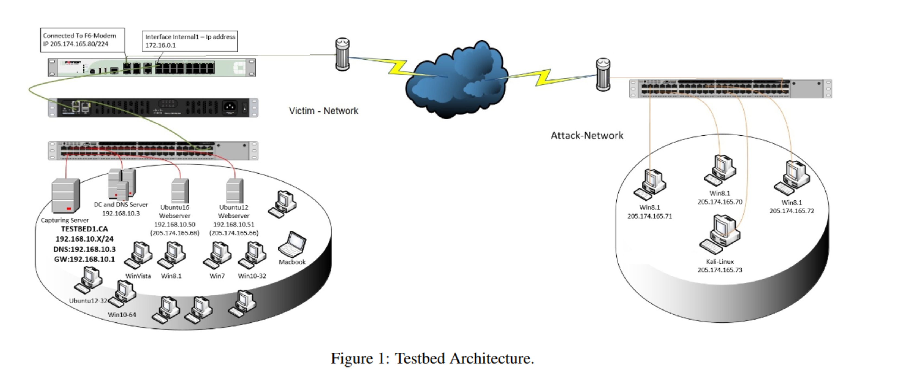
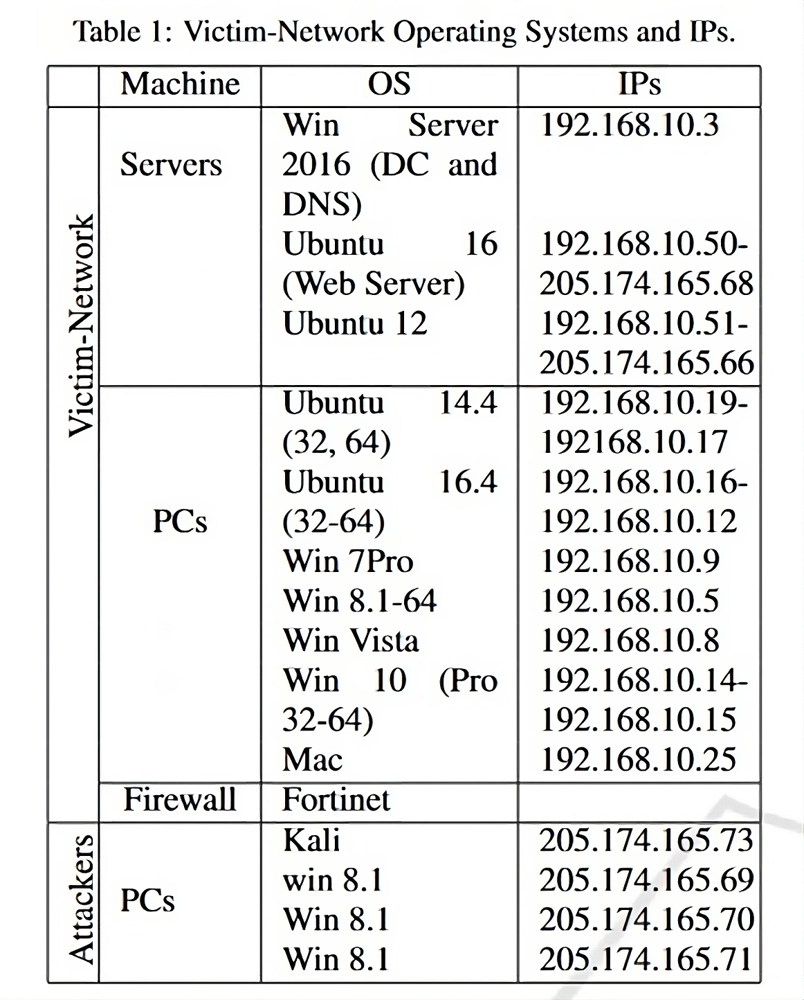

CIC-IDS2017 - Intrusion Detection Dataset
=========================================

.. This page will contain the general dataset description. in case we want to add more dataset, we can add it using this format. 

.. Here, ````dataset1_desc```` is the title of the page ````dataset1_desc.rst```` and also the filename. We need both to be same to get sphinx to work correctly. 

.. this toc creates new sub pages.


.. .. toctree::
..    :maxdepth: 2

..    dataset1_desc
..    dataset2_desc


.. .. note::
..    TODO:

..    \(Not necessarily in this order:\)

..    * Analysis of CIC-IDS2017
..       * Description of how it was made/collected
..          * Contains most up-to-date common attacks (as of 2017)
..          * Generated PCAPs
..          * Uses `CICFlowMeter <https://github.com/ahlashkari/CICFlowMeter>` to generate the CSVs
..          * Authors link to a `feature description page <http://ww1.netflowmeter.ca/netflowmeter.html?usid=16&utid=30620052538>`, though gives an empty page
..          * Generated realistic background traffic
..             * Authors used their own proposed B-Profile system (Sharafaldin, et al. 2016)
..             * Built abstract behaviour of 25 users based on the HTTP, HTTPS, FTP, SSH, and email protocols.
..       * Related work
..       * How it relates to Ethical Hacking \(more line a general requirement of this section\)
..       * Description of PCAP and relation to extracted features in the csv \(lower priority than the rest\)

..    Feel free to add to this.

.. **Description of different recorded days**:

..    The data capturing period started at 9 a.m., Monday, July 3, 2017 and ended at 5 p.m. on Friday July 7, 2017, for a total of 5 days. Monday is the normal day and only includes the benign traffic. The implemented attacks include Brute Force FTP, Brute Force SSH, DoS, Heartbleed, Web Attack, Infiltration, Botnet and DDoS. They have been executed both morning and afternoon on Tuesday, Wednesday, Thursday and Friday.


.. **Authors previously outlined 11 critera for building a reliable benchmark dataset:**

..    In our recent dataset evaluation framework (Gharib et al., 2016), we have identified eleven criteria that are necessary for building a reliable benchmark dataset. None of the previous IDS datasets could cover all of the 11 criteria. In the following, we briefly outline these criteria:

..    Complete Network configuration: A complete network topology includes Modem, Firewall, Switches, Routers, and presence of a variety of operating systems such as Windows, Ubuntu and Mac OS X.

..    Complete Traffic: By having a user profiling agent and 12 different machines in Victim-Network and real attacks from the Attack-Network.

..    Labelled Dataset: Section 4 and Table 2 show the benign and attack labels for each day. Also, the details of the attack timing will be published on the dataset document.

..    Complete Interaction: As Figure 1 shows, we covered both within and between internal LAN by having two different networks and Internet communication as well.

..    Complete Capture: Because we used the mirror port, such as tapping system, all traffics have been captured and recorded on the storage server.

..    Available Protocols: Provided the presence of all common available protocols, such as HTTP, HTTPS, FTP, SSH and email protocols.

..    Attack Diversity: Included the most common attacks based on the 2016 McAfee report, such as Web based, Brute force, DoS, DDoS, Infiltration, Heart-bleed, Bot and Scan covered in this dataset.

..    Heterogeneity: Captured the network traffic from the main Switch and memory dump and system calls from all victim machines, during the attacks execution.

..    Feature Set: Extracted more than 80 network flow features from the generated network traffic using CICFlowMeter and delivered the network flow dataset as a CSV file. See our PCAP analyzer and CSV generator.

..    MetaData: Completely explained the dataset which includes the time, attacks, flows and labels in the published paper.

..    The full research paper outlining the details of the dataset and its underlying principles:

..     Iman Sharafaldin, Arash Habibi Lashkari, and Ali A. Ghorbani, “Toward Generating a New Intrusion Detection Dataset and Intrusion Traffic Characterization”, 4th International Conference on Information Systems Security and Privacy (ICISSP), Purtogal, January 2018


.. General Information 
.. ---------------------------
.. CIC - Canadian Institute for Cybersecurity
.. IDS - Intrusion Detection System
.. Generated PCAP files 
.. Labelled Flow graphs
.. 5 days (9 a.m. - 5 p.m.) → We use Thursday afternoon 
.. 288602 rows × 79 columns
.. Labels benign (288566) and non-benign (36) → heavily unbalanced


Background
----------
Intrusion detection acts as the vital first line of defence for security administrators in order to be notified regarding malicious actors within their network. These systems are meant to notify security administrators possible intrusion into the network, attacks on the network, or malware infections. Having a good intrusion detection system ensures that administrators get notified on time and can take start taking steps towards mitigating and quarantine. The key is to allow the attackers as little time within the private network as possible. In the era of constant cyberattacks on major companies and even governments, the need for a good intrusion detection system becomes critical. 

The need for intrusion detection systems is clear, but in order to study them effectively, researchers require data. These datasets are required in order to better understand the network trends that present themselves before, during and after an attack in order to build better models for detection. These models need not necessarily be Machine Learning based, they could also be based on firewall rules or other similar existing methods to block network traffic. However, in order to acheive this, we need real world attack data, which includes both user and attacker network behaviour. This however, is a hard task to accomplish. When a real world attack on a network occurs and is detected, the priority at the moment is to mitigate the attack. It is not feasible to ask administratorsto set up proper network capture in the moment so it could be later analysed. If someone does have network capturing set up beforehand, it becomes a major privacy concern if that data is to be released to the public without prior filtration and anonymisation techniques. Once the data is anonymised to the required degree, it becomes much less useful for researchers looking to identify patterns in the data. 

In order to bridge this gap and to provide useable data  to researcher that is representative of the real world, with a variety of attacks and benign network traffic, the Canadian Institute for Cybersecurity (CIC) introduces the Intrudion Detection System (IDS) dataset. This dataset is presented to us courtesy of Sharafaldin et al. since 2017. The dataset is available `here <https://www.unb.ca/cic/datasets/ids-2017.html>`_.

When the authors were surveying the literature, they also evaluated previously available public datasets. Below is the list of IDS datasets they considered:

#. `DARPA (Lincoln Laboratory 1998-99) <https://www.ll.mit.edu/r-d/datasets/1998-darpa-intrusion-detection-evaluation-dataset>`_ 
#. `KDD'99 (University of California, Irvine 1998-99) <https://kdd.ics.uci.edu/databases/kddcup99/kddcup99.html>`_
#. `DEFCON (The Shmoo Group, 2000-2002) <https://seclists.org/ids/2000/Aug/55>`_
#. `CAIDA (Center of Applied Internet Data Analysis 2002-2016) <https://www.caida.org/catalog/datasets/about/downloads/>`_
#. `LBNL (Lawrence Berkeley National Laboratory and ICSI 2004-2005) <https://tools.netsa.cert.org/silk/referencedata.html#LBNL05>`_
#. `CDX (United States Military Academy 2009) <https://www.westpoint.edu/centers-and-research/cyber-research-center/data-sets>`_
#. `Kyoto (Kyoto University 2009) <https://www.takakura.com/Kyoto_data/>`_
#. `Twente (University of Twente 2009) <https://research.utwente.nl/en/publications/_a-labeled-data-set-for-flow-based-intrusion-detection>`_
#. UMASS (University of Massachusetts 2011)
#. `ISCX2012 (University of New Brunswick 2012) <https://www.unb.ca/cic/datasets/ids.html>`_
#. `ADFA (University of New South Wales 2013) <https://research.unsw.edu.au/projects/adfa-ids-datasets>`_
#. `ISOT (Intrusion Dataset 2008) <https://onlineacademiccommunity.uvic.ca/isot/datasets/>`_
#. `CTU-13 (CTU University 2013) <https://www.stratosphereips.org/datasets-ctu13/>`_
#. `SSHCure (University of Twente 2014) <https://research.utwente.nl/en/publications/sshcure-a-flow-based-ssh-intrusion-detection-system>`_
#. `UGR'16 (University of Granada 2016) <https://nesg.ugr.es/nesg-ugr16/>`_

However, they found these existing datasets to be lacking. Mainly, the authors outlined 11 characteristics that are critical for a comprehensive and valid IDS dataset. These are:

* Complete Traffic
* Attack Diversity
* Anonymity
* Available Protocols
* Complete Capture
* Complete Interaction
* Complete Network Configuration
* Feature Set
* Heterogeneity
* Labelling
* Metadata

They found the existing datasets to be lacking in some regards, none of them offering all the essential characteristics. Thus, the authors introduce the CIC-IDS-2017 dataset to bridge this gap.

Network Configuration
---------------------

In order to simulate attacks and normal user traffic. The authors contruct a netowrk of computers and servers that are split conceptually into 2 different networks: Attacker Network and Victim Network. This can be represented as follows:



Attacker Network
~~~~~~~~~~~~~~~~
The attacker internal network contains the following devices:

* 1 Router
* 1 Switch
* 1 Kali based PC
* 3 Windows 8.1 PCs


Victim Network
~~~~~~~~~~~~~~

The victim network consists of the following devices and firewall:

* Fortinet firewall
* 3 Servers (Windows Server 2016, Ubuntu 16)
* 2 Switches
* 10 PCs connected via Domain Controller (DC), Active Directory 

The PCs consist of a mix of the major operating systems, which include Ubuntu 14.4, 16.4, Windows 7 Professional, Windows 8.1, Windows Vista, Windows 10 and Macintosh. 

The following image shows the network details described above



We can see that the network consists of a mix of Operating systems and devices such as switches and routers. It also includes a firewall. This showcases that the dataset is representative of the real world.

**In order to capture the data, a mirror port was created on the Victim network that allowed capturing of complete incoming and outgoing packet data.** 

The packet data was captured using this port and stored as PCAP files, which is a specialised data format in order to store network activity data for a time period. This format is available as an API exposed by the operating system (libpcap,WinPcap) and can be easily captured using tools such as `tcpdump <https://www.tcpdump.org/>`_ or `Wireshark <https://www.wireshark.org/>`_.


Attacks and Scenario
---------------------

Attacks
~~~~~~~
The kind of attacks that were performed while capturing the dataset are described below:

* **Brute Force** - These attacks are used in order to find hidden pages and content on web applications, and for password cracking. These are carried out by using tools such as Hydra, Medusa, Ncrack, hashcat and hashpump for password cracking and Nmap NSE scripts and Metasplot modules are used to probe the victim using 30 different methods such as FPT, SSH, SMTP, Telnet, etc.
  
* **HeartBleed Attack** - Heartbleed is an infamous OpenSSL vulnerability that is caused due to malformed implementation of TLS protocol. This has been patched, but software is not always updated so attackers still try these attacks. The authors compile an older version of OpenSSL that is vulnerable to this attack.
  
* **Botnet** - The ARES python based botnet was used, and 5 PCs were infected in the victim network to emulate an attack of a botnet.
  
* **DoS attack** - Hulk, GoldenEye, slowloris and Slowhttptest are used in order to simulate a DoS attack on victim server, attacking the Apache webserver serving web application
  
* **DDoS attack** - Low Orbit Ion Canon (LOIC) is a network stress testing tool to simulate DDoS attacks. It is used along with portscanning using all available main Nmap switches in order to flood the victim with UDP, TCP and HTTP requests.
  
* **Web attacks** - the Damn Vulnerable Web App, which is a PHP/MySQL based webapp is served from a server to simulate the victim. This is the web application used for testing in all scenarios. This is also subjected to XSS attacks using automated Selenium scripts.
  
* **Infiltration attacks** - the authors try to mimic real world infiltration attacks in the form of malicious Dropbox download links for Windows devices, and malicious USB drives for Macintosh devices. They use these methods to get the user to download malicious software, that targets common vulnerable software such as Adobe Acrobat Reader. If the attack is successful, they payload dropped can conduct IP sweeps and port scanning of the internal Victim network via Nmap.

The authors used the above described softwares for the different uses and employed the use of Python scripts in order to automate the attacks in parallel using multiprocessing. 

The different kinds of attacks are mixed, and across a 5 day period - Monday to Friday, from 9 a.m. to 5 p.m. these attacks were simulated on the described network configuration. The complete dataset consists of multiple PCAP files, separated according to the day the data was collected. The authors also provide the data extracted into csv format for easy consumption. 

For our experiments, we specifically chose the **Thursday afternoon** subset of the csv dataset. We describe the kind of attacks the network experiences that day below. This specific subset was chosen as this contains a major class imbalance in terms of the Benign and Attack labels in the dataset. We feel this is representative of real world scenarios, whereas the other subsets were more balanced. It also allows us to showcase various data augmentation techinques discussed in the literature.

Victims
~~~~~~~

In order to mimic benign user traffic on the Victim network, the authors used their proposed B-Profile system. This system is capable of profiling user network interactions and generate natural traffic based on learnt profile. In order to generate the data, the authors used a dataset that contained user network traffic of 25 individuals, containing differnt protocols such as SSH, HTTP, SMTP, HTTPS, FTP, etc. The B-Profile system learnt a comprehensive profile based on this normal user traffic, using statistical and machine laerning based methods. This was used to derive a B-Profile that will mimic normal users. Finally, an agent written in Java is used to generate the benign network traffic with similar characteristics. This generated data was used as the basis of all data labelled "Benign" in the final IDS dataset.

.. Describe user profile

Scenario
~~~~~~~~

As we mentioned earlier, the dataset contains multiple PCAP files for the 5 different days. However, the authors also provide a ``MachineLearningCSV.zip`` file. This contains data extracted into CSV format for easy use in Machine Learning. These files are also plit across the days. Each of these files are also quite sizeable. Fow our experiments, we specifically use ``Thursday-WorkingHours-Afternoon-lnfilteration.pcap_ISCX.csv`` file. As the name suggests, This specifically contains benign data, as well as Infilteration attacks mentioned before. The attack description in this dataset looks as follows:

.. Describe scenario

* **Infiltration** – Dropbox download attack vector

   Metasploit module used to exploit Win Vista between (14:19 and 14:20-14:21 p.m.) and (14:33 -14:35)

   Attacker: Kali, 205.174.165.73

   Victim: Windows Vista, 192.168.10.8


* **Infiltration** – USB disk attack vector 

   Cool Disk utility used to exploit Mac between (14:53 p.m. – 15:00 p.m.)

   Attacker: Kali, 205.174.165.73

   Victim: Mac, 192.168.10.25


* **Infiltration** – Dropbox download attack vector

   Metasploit module used to exploit Win Vista between (15:04 – 15:45 p.m.)

      * First Step:

      Attacker: Kali, 205.174.165.73

      Victim: Windows Vista, 192.168.10.8


      * Second Step (Portscan + Nmap):

      Attacker:Vista, 192.168.10.8

      Victim: All other clients


Features
--------

In order to extract features from the captured PCAP files, the authors used CICFlowMeter to process the PCAP files and extract the most relevant features for research, such as source IP/port, destination IP/port, etc. 80 such features were extracted, along with their timestamps. This data is then labelled manually by the authors by checking the attack schedule described above and labelling the traffic from the given machines accordingly. 

.. note:: 
   The complete list of features extracted is as follows: ``"Destination Port", "Flow Duration", "Total Fwd Packets", "Total Backward Packets", "Total Length of Fwd Packets", "Total Length of Bwd Packets", "Fwd Packet Length Max", "Fwd Packet Length Min", "Fwd Packet Length Mean", "Fwd Packet Length Std", "Bwd Packet Length Max", "Bwd Packet Length Min", "Bwd Packet Length Mean", "Bwd Packet Length Std", "Flow Bytes/s", "Flow Packets/s", "Flow IAT Mean", "Flow IAT Std", "Flow IAT Max", "Flow IAT Min", "Fwd IAT Total", "Fwd IAT Mean", "Fwd IAT Std", "Fwd IAT Max", "Fwd IAT Min", "Bwd IAT Total", "Bwd IAT Mean", "Bwd IAT Std", "Bwd IAT Max", "Bwd IAT Min", "Fwd PSH Flags", "Bwd PSH Flags", "Fwd URG Flags", "Bwd URG Flags", "Fwd Header Length", "Bwd Header Length", "Fwd Packets/s", "Bwd Packets/s", "Min Packet Length", "Max Packet Length", "Packet Length Mean", "Packet Length Std", "Packet Length Variance", "FIN Flag Count", "SYN Flag Count", "RST Flag Count", "PSH Flag Count", "ACK Flag Count", "URG Flag Count", "CWE Flag Count", "ECE Flag Count", "Down/Up Ratio", "Average Packet Size", "Avg Fwd Segment Size", "Avg Bwd Segment Size", "Fwd Header Length", "Fwd Avg Bytes/Bulk", "Fwd Avg Packets/Bulk", "Fwd Avg Bulk Rate", "Bwd Avg Bytes/Bulk", "Bwd Avg Packets/Bulk", "Bwd Avg Bulk Rate", "Subflow Fwd Packets", "Subflow Fwd Bytes", "Subflow Bwd Packets", "Subflow Bwd Bytes", "Init_Win_bytes_forward", "Init_Win_bytes_backward", "act_data_pkt_fwd", "min_seg_size_forward", "Active Mean", "Active Std", "Active Max", "Active Min", "Idle Mean", "Idle Std", "Idle Max", "Idle Min", "Label"``


.. Technical information related to selected dataset subset (copied from the official dataset webpage)
.. ---------------------------------------------------------------------------------------------------


Comparison to other datasets
------------------------------

.. The CICIDS2017 dataset by Sharafaldin et al. comprises of the following vector attacks: DoS, DDoS, brute force, XSS, SQL injection, infiltration, port scan and botnet. Our selected subset contains data from Infiltration attacks. The reason why we selected this specific subset is because of its heavily unbalanced characteristics (with regard to the benign versus malicious traffic), which make it a more realistic and rerpresentative option, as in the literature and real world samples for the benign (majority) class tend to largely outweigh the minority class samples.

Table 1 :ref:`my_table_reference` demonstrates the importance of the CICIDS2017 for the Ethical Hacking research community, as it directly compares it to other existing intrusion detection datasets, clearly revealing where previous datasets are lacking and how the present dataset fits more criteria that are important for studying network attacks.

*Table from Sharafaldin et al. (2017). This table outlines the identified Intrusion Detection datasets from previous studies compared on a taxonomy with 21 unique characteristics. CICIDS2017 contains nearly all characteristics, whereas the other datasets do not appear to be as comprehensive according to the authors. The rows denote the relevant dataset and the columns refer to each specific criterion.*

.. _my_table_reference:

.. table:: Comparing available IDS datasets based on the dataset evaluation framework. Sharafaldin et al. (2017).
   
   +--------+---------+---------+---------+-----------+--------+----------+-------+-------+-------+-------+---------+--------+------+------+-------+-------+-------+-------+-------+-------+--------+
   |        | Network | Traffic | Label.  | Interact. | Captu. | Protocols|       |       |        |      | Attack  |        |      |      |       |       |       | Ano.  | Heter.| Feat. | Meta.  |
   +--------+---------+---------+---------+-----------+--------+----------+-------+-------+-------+-------+---------+--------+------+------+-------+-------+-------+-------+-------+-------+--------+
   |        |         |         |         |           |        | HTTP     | HTTPS | SSH   | FTP   | Email | Browser | Bforce | DoS  | Scan | Bdoor | DNS   | Other |       |       |       |        |
   +========+=========+=========+=========+===========+========+==========+=======+=======+=======+=======+=========+========+======+======+=======+=======+=======+=======+=======+=======+========+
   | DARPA  | ✅      | ❌      | ✅      | ✅        | ✅     | ✅       | ❌    | ✅    | ✅    | ❌    | ✅      | ✅     | ✅   | ❌   | ❌    | ✅    | ❌    | ❌    | ❌    | ✅    | ✅     |
   +--------+---------+---------+---------+-----------+--------+----------+-------+-------+-------+-------+---------+--------+------+------+-------+-------+-------+-------+-------+-------+--------+
   | KDD’99 | ✅      | ❌      | ✅      | ✅        | ✅     | ✅       | ❌    | ✅    | ✅    | ❌    | ✅      | ✅     | ✅   | ❌   | ❌    | ✅    | ❌    | ❌    | ✅    | ✅    | ✅     |
   +--------+---------+---------+---------+-----------+--------+----------+-------+-------+-------+-------+---------+--------+------+------+-------+-------+-------+-------+-------+-------+--------+
   | DEFCON | ❌      | ❌      | ❌      | ✅        | ✅     | ❌       | ✅    | ❌    | ❌    | ❌    | ❌      | ❌     | ✅   | ✅   | ❌    | ✅    | ?     | ❌    | ❌    | ❌    | ❌     |
   +--------+---------+---------+---------+-----------+--------+----------+-------+-------+-------+-------+---------+--------+------+------+-------+-------+-------+-------+-------+-------+--------+
   | CAIDA  | ✅      | ✅      | ❌      | ❌        | ❌     | ?        | ?     | ?     | ?     | ❌    | ❌      | ❌     | ✅   | ✅   | ❌    | ✅    | ✅    | ❌    | ❌    | ✅    | ❌     |
   +--------+---------+---------+---------+-----------+--------+----------+-------+-------+-------+-------+---------+--------+------+------+-------+-------+-------+-------+-------+-------+--------+
   | LBNL   | ✅      | ✅      | ❌      | ❌        | ❌     | ✅       | ❌    | ✅    | ❌    | ?     | ?       | ?      | ✅   | ?    | ?     | ?     | ✅    | ❌    | ❌    | ❌    | ❌     |
   +--------+---------+---------+---------+-----------+--------+----------+-------+-------+-------+-------+---------+--------+------+------+-------+-------+-------+-------+-------+-------+--------+
   | CDX    | ❌      | ❌      | ❌      | ✅        | ✅     | ❌       | ✅    | ✅    | ✅    | ❌    | ❌      | ✅     | ✅   | ❌   | ✅    | ?     | ?     | ❌    | ❌    | ❌    | ❌     |
   +--------+---------+---------+---------+-----------+--------+----------+-------+-------+-------+-------+---------+--------+------+------+-------+-------+-------+-------+-------+-------+--------+
   | KYOTO  | ✅      | ❌      | ✅      | ✅        | ✅     | ✅       | ✅    | ✅    | ✅    | ✅    | ✅      | ✅     | ✅   | ✅   | ✅    | ✅    | ❌    | ❌    | ✅    | ✅    | ✅     |
   +--------+---------+---------+---------+-----------+--------+----------+-------+-------+-------+-------+---------+--------+------+------+-------+-------+-------+-------+-------+-------+--------+
   | TWENTE | ✅      | ✅      | ✅      | ✅        | ✅     | ❌       | ✅    | ✅    | ❌    | ❌    | ✅      | ❌     | ✅   | ❌   | ❌    | ✅    | ?     | ?     | ❌    | ✅    | ❌     |
   +--------+---------+---------+---------+-----------+--------+----------+-------+-------+-------+-------+---------+--------+------+------+-------+-------+-------+-------+-------+-------+--------+
   | UMASS  | ✅      | ❌      | ✅      | ❌        | ✅     | ❌       | ❌    | ❌    | ❌    | ❌    | ❌      | ❌     | ❌   | ❌   | ❌    | ✅    | ?     | ?     | ❌    | ❌    | ❌     |
   +--------+---------+---------+---------+-----------+--------+----------+-------+-------+-------+-------+---------+--------+------+------+-------+-------+-------+-------+-------+-------+--------+
   | ISCX   | ✅      | ❌      | ✅      | ✅        | ✅     | ❌       | ✅    | ✅    | ✅    | ✅    | ✅      | ✅     | ✅   | ✅   | ✅    | ❌    | ✅    | ❌    | ✅    | ❌    | ✅     |
   +--------+---------+---------+---------+-----------+--------+----------+-------+-------+-------+-------+---------+--------+------+------+-------+-------+-------+-------+-------+-------+--------+
   | ADFA   | ✅      | ✅      | ✅      | ✅        | ✅     | ❌       | ✅    | ✅    | ✅    | ✅    | ✅      | ❌     | ❌   | ✅   | ❌    | ✅    | ❌    | ?     | ❌    | ✅    | ✅     |
   +--------+---------+---------+---------+-----------+--------+----------+-------+-------+-------+-------+---------+--------+------+------+-------+-------+-------+-------+-------+-------+--------+
   | ISOT   | ✅      | ✅      | ✅      | ✅        | ✅     | ❌       | ❌    | ❌    | ✅    | ❌    | ❌      | ❌     | ❌   | ❌   | ❌    | ✅    | ✅    | ❌    | ❌    | ✅    | ❌     |
   +--------+---------+---------+---------+-----------+--------+----------+-------+-------+-------+-------+---------+--------+------+------+-------+-------+-------+-------+-------+-------+--------+
   | SSHCure| ✅      | ✅      | ✅      | ✅        | ❌     | ❌       | ✅    | ❌    | ❌    | ❌    | ✅      | ❌     | ❌   | ❌   | ❌    | ❌    | ❌    | ❌    | ❌    | ✅    | ❌     |
   +--------+---------+---------+---------+-----------+--------+----------+-------+-------+-------+-------+---------+--------+------+------+-------+-------+-------+-------+-------+-------+--------+
   | CTU-13 | ✅      | ✅      | ✅      | ✅        | ✅     | ❌       | ❌    | ❌    | ❌    | ✅    | ❌      | ✅     | ✅   | ✅   | ❌    | ✅    | ❌    | ❌    | ✅    | ✅    | ✅     |
   +--------+---------+---------+---------+-----------+--------+----------+-------+-------+-------+-------+---------+--------+------+------+-------+-------+-------+-------+-------+-------+--------+
   | UGR'16 | ✅      | ✅      | ✅      | ✅        | ✅     | ✅       | ✅    | ✅    | ✅    | ❌    | ❌      | ✅     | ❌   | ✅   | ❌    | ✅    | ✅    | ❌    | ❌    | ✅    | ✅     |
   +--------+---------+---------+---------+-----------+--------+----------+-------+-------+-------+-------+---------+--------+------+------+-------+-------+-------+-------+-------+-------+--------+
   | CICIDS | ✅      | ✅      | ✅      | ✅        | ✅     | ✅       | ✅    | ✅    | ✅    | ✅    | ✅      | ✅     | ✅   | ✅   | ✅    | ✅    | ✅    | ❌    | ✅    | ✅    | ✅     |
   +--------+---------+---------+---------+-----------+--------+----------+-------+-------+-------+-------+---------+--------+------+------+-------+-------+-------+-------+-------+-------+--------+

   *Table from Sharafaldin et al. (2017). This table outlines the identified Intrusion Detection datasets from previous studies compared on a taxonomy with 21 unique characteristics. CICIDS2017 contains nearly all characteristics, whereas the other datasets do not appear to be as comprehensive according to the authors. The rows denote the relevant dataset and the columns refer to each specific criterion.*

Overall, the presented dataset is the only one that exhibits most of the characteristics the authors deemed fit for building the ideal IDS dataset, compared to other publically available datasets. Specifically, this dataset is the only one that offers:

* **Complete Traffic** - having multiple victim machines based on real user profiles and real attacks
* **Labelled Dataset** - as described from the attack timings and machines
* **Complete Interaction** - dataset contains internal and intranet traffic between attackers and victims 
* **Complete Capture** - all incoming and outgoing data captures through the use of the mirror port on victim network
* **Available Protocols** - dataset contains all commonly available protocols such as HTTP, HTTPS, FTP, SSH and email protocols.
* **Attack Diversity** - complete dataset contains a healthy mix of  attacks that are Web based, Brute force, DoS, DDoS, Infiltration, Heart-bleed, Bot and Scan already covered in this dataset. 
* **Heterogeneity** - the authors capture the network traffic from the main switch and memory dump and system calls from all victim machines during the attacks execution
* **Feature Set** - is provided by extracting more than 80 network flow features from the generated network traffic and delivering the network flow dataset as a CSV file.
* **Metadata** - extensive explanation and detail of the dataset is provided.


References
---------------------------
Iman Sharafaldin, Arash Habibi Lashkari, and Ali A. Ghorbani, **“Toward Generating a New Intrusion Detection Dataset and Intrusion Traffic Characterization”**, *4th International Conference on Information Systems Security and Privacy (ICISSP), Portugal*, January 2018

Iman Sharafaldin, et al. **"BotViz: A memory forensic-based botnet detection and visualization approach."** *2017 International Carnahan Conference on Security Technology (ICCST)*. IEEE, 2017.


.. Notes for Constantinos (to myself):
.. 7 attack vector types
.. 16 publicly available datasets and 11 distinct criteria based on what (ref)?
.. The extensive label set additionally demonstrates the authors' attempt to capture different types of attach without rersorting to simplistic binary classifications such as benign and nnon-benign.
.. pages 189-191 might contain useful info but it looks more CS heavy. Can someone look into them?

.. The original dataset contains with the full feature set evidently contains certain features that might not be as informative for classifying benign and malicious traffic. Naturally some variables will be more indicative of the nature behind a particular traffic flow. Following this rationale, the authors performed a statistical analysis that led to the conclusion that the following features had a higher impact: "flow
.. duration, inter-arrival time related features (for flow, forward and backward categories) and idle time related features." These results can be informative for Ethical Hacking researchers planning to collect data for traffic monitoring with a focus on detecting malicious traffic, as the authors point out that the aforementioned variables were indicative of malicious intent.
.. Stopped at p.194 (included).

 

